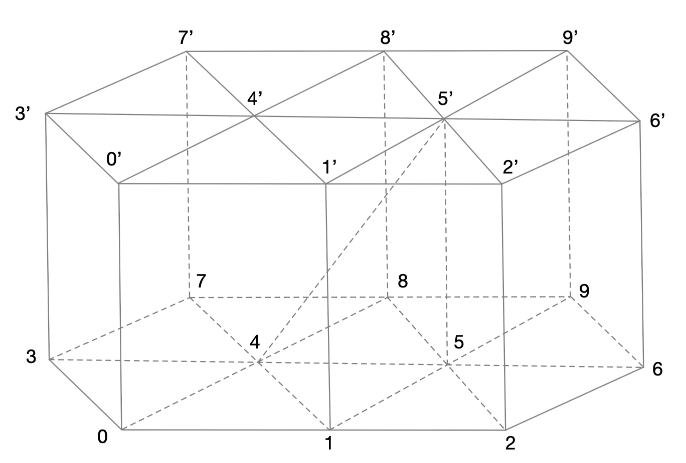
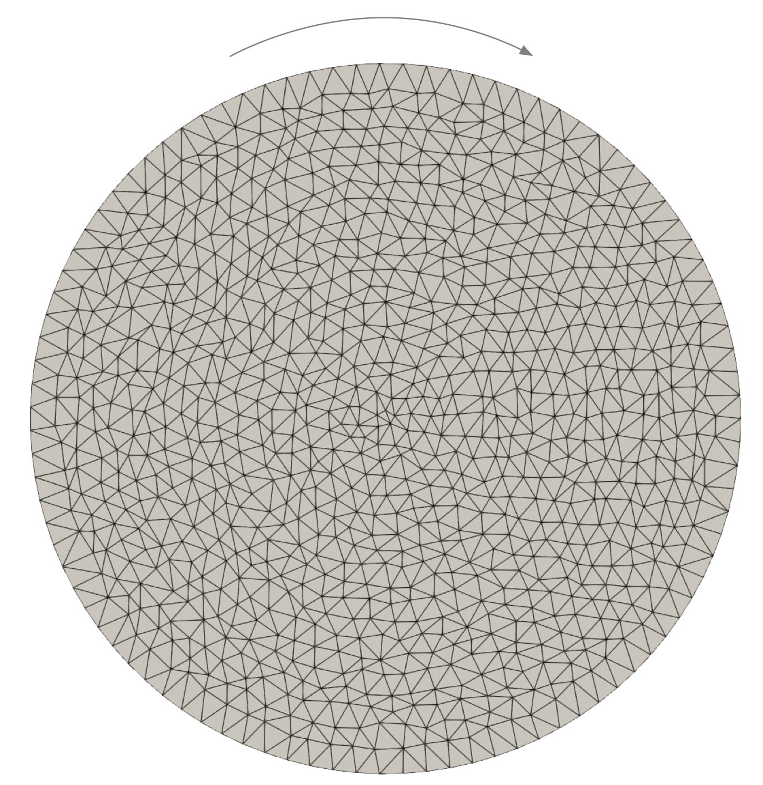

# DeformedSpaceTet

This Python implementation constructs a **tetrahedral mesh** for a **deformed 3D space (or spacetime)** by extruding two successive **2D triangular spatial meshes**. The algorithm ensures that the resulting 3D simplicial mesh respects all constraints from the input 2D meshes and their node connectivity relationships.

The algorithm is based on the paper *Fast and Invertible Simplicial Approximation of Magnetic-Following Interpolation for Visualizing Fusion Plasma Simulation Data* (under review).

## Table of Contents
- [Dependencies](#dependencies)
- [Usage](#usage)
- [Examples](#examples)
- [Citation](#citation)
- [License](#license)

---

## Dependencies
To run the meshing algorithm, the following packages are required:

- [NumPy](https://numpy.org)
- [H5py](https://www.h5py.org)
- [Shapely](https://shapely.readthedocs.io)
- [NetworkX](https://networkx.github.io)
- [Matplotlib](https://matplotlib.org)
- [VTK](https://vtk.org)

If you do not have these packages installed, use the following command:

```bash
pip install numpy h5py shapely networkx vtk
```

---

## Usage
```bash
python DeformedSpaceTet.py [Path to input HDF5 file] -o [Path to output file (optional)] -i -vtk
```
### Parameters
- **`[Path to input HDF5 file]`**  
  Path to the input file with the following structure:

```plaintext
mesh.h5
├── /lower_nodes    (Nx2)  - Node coordinates of the lower layer mesh
├── /lower_cells    (Mx3)  - Connectivity list of the lower layer mesh
├── /next_nodes     (Nx1)  - Node connectivity between two layers
├── /upper_nodes    (N'x2) - (Optional) Node coordinates of the upper layer mesh
└── /upper_cells    (M'x3) - (Optional) Connectivity list of the upper layer mesh
```

- **`[Path to output file (optional)]`**  
  Path to the output `.pickle` file containing the generated simplicial mesh.

- **`-i`** *(flag)*  
  Indicates that the **upper and lower layers have the same mesh**.  
  If this flag is used, the input HDF5 file **does not need** `/upper_nodes` and `/upper_cells`.

- **`-vtk`** *(flag)*  
  Use this flag if **.vtu output is needed**.

---

## Output
By default, the output is a `.pickle` file containing a list of tetrahedra, where each tetrahedron is represented as:

```plaintext
(node_idx0, 'l'), (node_idx1, 'l'), (node_idx2, 'l'), (node_idx3, 'u')   # Example 1
(node_idx0, 'l'), (node_idx1, 'l'), (node_idx2, 'u'), (node_idx3, 'u')   # Example 2
(node_idx0, 'l'), (node_idx1, 'u'), (node_idx2, 'u'), (node_idx3, 'u')   # Example 3
```
- `node_idx`: The index of a node in the original input file.
- `'l'`: Indicates the node belongs to the **lower layer**.
- `'u'`: Indicates the node belongs to the **upper layer**.

To export the tetrahedral mesh in `.vtu` format, use the `-vtk` flag.

---

## Examples
```bash
python DeformedSpaceTet.py data/test1.h5 -o test1 -i -vtk
```
There are two examples in the `data/` folder. `test1.h5` is a simple deformed space as shown below:


`test2.h5` models a rotating circular field:


---

## Citation
If you use this work, please cite:

Ren, Congrong, and Hanqi Guo.  
[Fast and Invertible Simplicial Approximation of Magnetic-Following Interpolation for Visualizing Fusion Plasma Simulation Data](https://arxiv.org/abs/2309.02677).  
*arXiv preprint arXiv:2309.02677 (2023).*

---

## License
Standard MIT disclaimer applies. See [LICENSE](blob/main/LICENSE) for full text.
